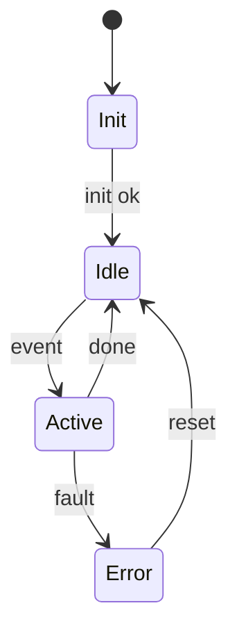

# 需求分析与硬件功能拆解 Skill

运行时调用：`/api/agent/analyze` 在功能分析时会自动读取本文件，并将其注入到 LLM 的 system messages 中。用户无需在界面中选择该 skill。

目标：帮助 AI 从用户自然语言需求中识别、澄清并拆分出需要硬件实现的功能，形成后续器件选型、资源规划、代码生成和测试调试可以直接使用的结构化输入。

适用场景：

- 用户只给出模糊产品想法，需要转成可执行的硬件功能列表。
- 用户描述了多个模块、交互、传感器、执行器、显示、通信或测试目标，需要逐项拆解。
- 生成固件代码、硬件资源表、框图或测试计划前，需要先确认哪些能力必须由硬件实现。
- 需求中存在软件逻辑、硬件模块、机械结构、上位机、量产设计等混杂描述，需要分层归类。
- 用户需求隐含模式切换、事件响应、持续运行、闭环控制、异常处理或上位机动作执行，需要先识别并设计应用状态机。

输入：

- 用户原始需求文本。
- 从 `prompt/` 读取的开发需求文档。
- 当前 SDK 扫描摘要，包括 `components/`、`bsp/`、`boards/`、`examples/`。
- 目标板卡名称和板级资源定义。
- 当前已有规划或用户补充问答。

核心原则：

- 不遗漏用户需求中明确出现的硬件模块；每个传感器、执行器、显示、通信、输入控件都必须逐项覆盖。
- 区分“必须实现”“可选增强”“待确认”“当前 SDK 缺口”。
- 先识别用户目标，再拆成硬件可实现功能，不要直接跳到代码。
- GPIO、I2C、UART、PWM、ADC 等资源必须以后续 `boards/` 定义为准，不要凭空猜引脚。
- 如果当前 SDK 没有对应 driver/service，必须标记为缺口或待开发模块，不要假设已有能力。
- 任何原理图、PCB、datasheet、量产判断都必须标注人工审核点。

分析步骤：

1. 提取产品目标
   - 用一句话总结用户想做的产品或 demo。
   - 判断产品形态：开发板验证、桌面设备、移动机器人、机械臂、传感器节点、上位机联调、量产硬件等。

2. 提取用户可见功能
   - 列出用户最终能感知或操作的功能。
   - 例如：按键切换模式、OLED 显示状态、ToF 避障、舵机扫描、WiFi 上报、语音播报、LED 灯效。

3. 拆分硬件实现功能
   - 输入类：按键、编码器、IMU、ToF、温度/湿度、ADC、电机反馈等。
   - 输出类：LED、OLED、舵机、电机、TTS、蜂鸣器、继电器等。
   - 通信类：WiFi、TCP、UDP、UART、I2C、SPI、CAN、RS485、上位机协议等。
   - 电源和结构类：供电方式、电池、保护、连接器、安装位置、机械约束等。
   - 调试和测试类：串口日志、monitor、physical agent、自动化测试命令、传感器断言等。

4. 形成开发任务拆解
   - 将需求拆成小任务，每个任务都应有明确输入、输出、依赖和验收方式。
   - 任务顺序建议：单模块验证 -> 资源整合 -> 状态机/业务逻辑 -> 联调 -> 测试 -> 可选优化。

5. 判断并设计状态机
   - 判断用户需求是否隐含状态机需求。以下情况通常需要状态机：多模式切换、按键短按/长按、传感器触发动作、运动控制、避障、自动巡航、联网控制、执行器安全停止、任务忙闲状态、故障恢复。
   - 如果需要状态机，必须列出状态、每个状态的职责、进入条件、退出条件和关键硬件动作。
   - 必须列出状态转移条件，条件要能映射到传感器读数、用户输入、超时、上位机命令或错误事件。
   - 状态机必须覆盖启动、正常运行、动作执行/等待、错误/异常、安全停止或恢复路径；如果某类路径不适用，要说明原因。
   - 对每个状态检查是否至少有明确进入路径；除明确的终止态外，每个状态都必须有退出路径。
   - 对每个传感器事件、用户输入、上位机命令、超时、错误事件检查是否有对应转移；不能只描述状态名而遗漏触发条件。
   - 如果多个条件可能同时触发，必须说明优先级或合并策略，例如急停优先于普通动作、故障优先于恢复、多个报警源同时触发时如何选择播报。
   - 需要避免不可达状态、死循环状态、无条件震荡、重复播报/重复刷新等不合理状态机设计。
   - 必须输出 Mermaid `stateDiagram-v2` 状态转移图，图中节点名要短，转移边标注条件要简洁。
   - 如果不需要状态机，也要明确写出“判断：否”和原因，不要强行设计状态图。

6. 检查状态机合理性和完整性
   - 完整性检查必须基于状态机设计和状态转移条件，而不是泛泛说“合理”。
   - 检查项至少包括：初始状态、正常路径、异常路径、恢复路径、每个状态的进入/退出、每个关键事件的转移、同时触发条件优先级、状态副作用是否只在进入/退出时执行。
   - 对检查结果使用“通过 / 风险 / 待确认”三类结论。
   - 如果发现状态机不完整，必须在“状态机完整性检查”中指出缺失项，并在“待确认问题”或“缺口和风险”中给出后续处理建议。

7. 生成澄清问题
   - 只提出会影响硬件资源、器件选型、代码结构或测试方案的问题。
   - 避免泛泛询问；问题应能指导下一步实现。

输出格式：

```markdown
## 需求摘要
- 产品目标：
- 产品形态：
- 目标板卡：

## 硬件功能清单
| 功能 | 类型 | 用户行为/系统行为 | SDK 组件 | 板级资源 | 状态 | 备注 |
|---|---|---|---|---|---|---|


## 功能拆解
1. 单模块验证：
2. 资源规划：
3. 应用状态机：
4. 联调：
5. 测试验收：

## 状态机需求判断
- 判断：是/否
- 原因：

## 状态机设计
| 状态 | 职责 | 进入条件 | 退出条件 | 硬件动作 |
|---|---|---|---|---|

## 状态转移条件
| From | To | 条件/事件 | 动作 |
|---|---|---|---|

## 状态机完整性检查
| 检查项 | 结论 | 说明 | 处理建议 |
|---|---|---|---|
| 初始状态是否明确 | 通过/风险/待确认 |  |  |
| 正常运行路径是否闭合 | 通过/风险/待确认 |  |  |
| 异常/错误路径是否覆盖 | 通过/风险/待确认 |  |  |
| 恢复路径是否明确 | 通过/风险/待确认 |  |  |
| 每个状态是否有进入路径 | 通过/风险/待确认 |  |  |
| 每个非终止状态是否有退出路径 | 通过/风险/待确认 |  |  |
| 关键事件是否都有转移 | 通过/风险/待确认 |  |  |
| 同时触发条件是否有优先级 | 通过/风险/待确认 |  |  |
| 进入/退出副作用是否避免重复执行 | 通过/风险/待确认 |  |  |

## 状态机状态转移图
如果“判断：是”，输出：



如果“判断：否”，写：暂无状态机图。

## 待确认问题
- 

## 缺口和风险
- 

## 下一步建议
- 
```


质量检查：

- 是否覆盖了用户需求中的每个硬件名词。
- 是否把纯软件逻辑和硬件实现功能分开。
- 是否明确了哪些功能当前 SDK 支持，哪些需要新增组件。
- 是否列出了会影响实现的板级资源和潜在冲突。
- 是否判断了需求中隐含的状态机，并在需要时给出状态、转移条件和 Mermaid 状态图。
- 是否检查了状态机完整性：初始状态、正常/异常/恢复路径、每个状态的进入/退出、关键事件转移、同时触发优先级和副作用执行时机。
- 是否给出了可执行的任务顺序和验收方式。
